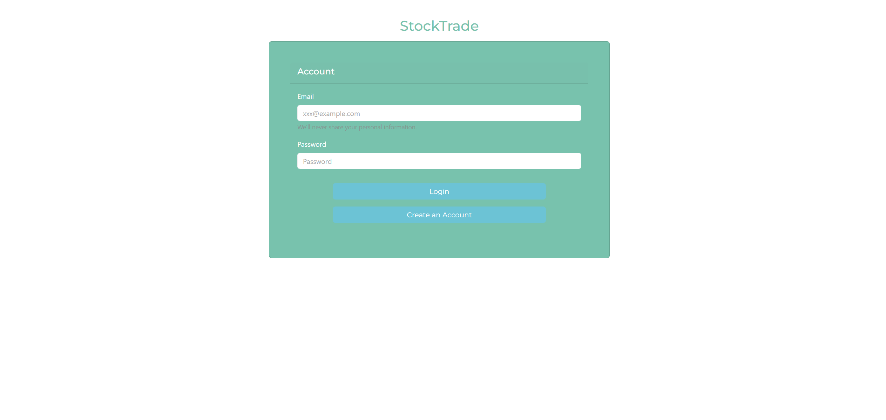
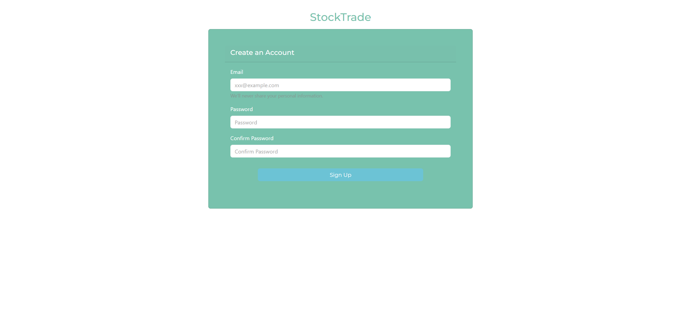
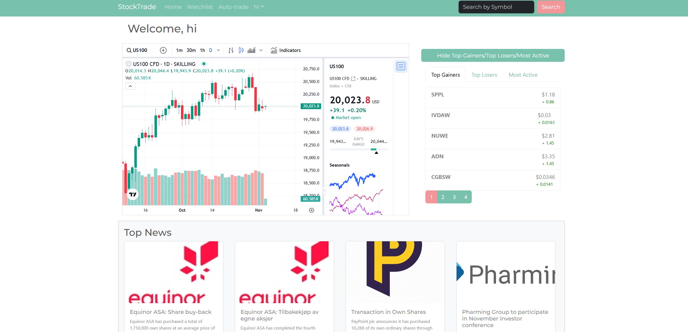
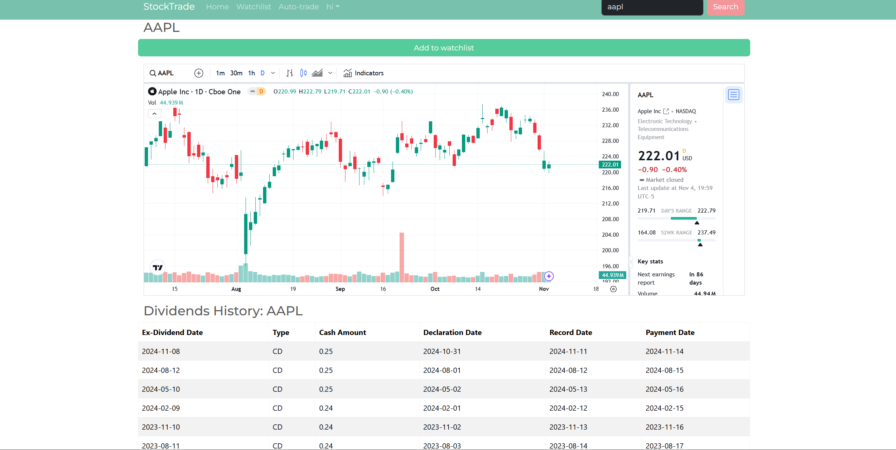
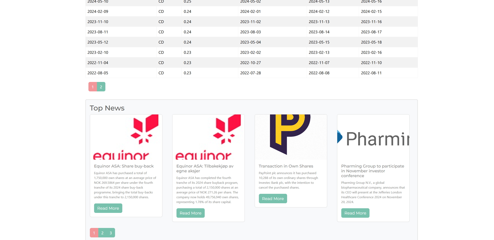
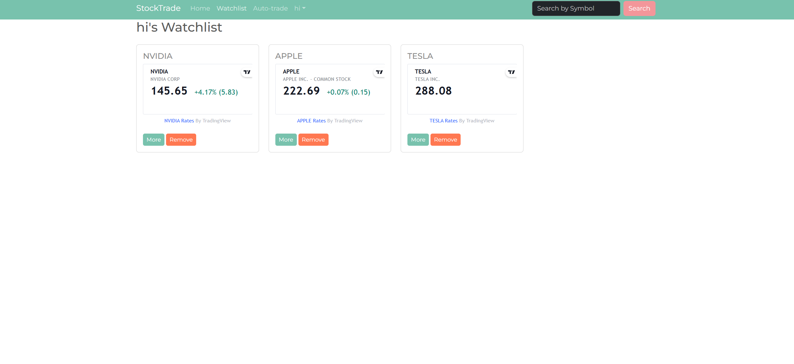

 <h4 align="center"><b>Stocktrade Viewing Application</b></h4>

Backend: Node.js, Express.js, MongoDB  
Frontend: Next.js, React, JavaScript, Bootstrap 
API: Polygon.io, Alpha Vantage, TradingView

To run this code: create a .env file on the backend and api keys and jwt_secret key are required. 
/backend/.env: 
MONGO_URI= 
JWT_SECRET= 
ALPHA_API_KEY= 
POLYGON_API_KEY=

Login page:

Signup page:

Main page:
/hi/main

search page:
/hi/aapl

watchlist page:
/hi/watchlist
